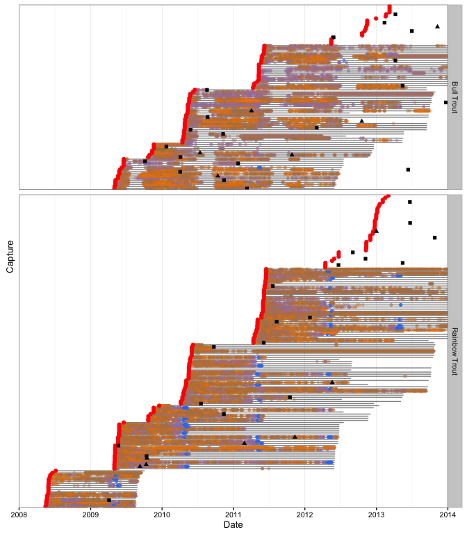

<!-- README.md is generated from README.Rmd. Please edit that file -->
``` r
library(dplyr)
#> 
#> Attaching package: 'dplyr'
#> 
#> The following objects are masked from 'package:stats':
#> 
#>     filter, lag
#> 
#> The following objects are masked from 'package:base':
#> 
#>     intersect, setdiff, setequal, union
library(magrittr)
library(qlexdatr)
library(lexr)

lex_data <- input_lex_data("qlexdatr")
lex_data %<>% check_lex_data()
#> Loading required package: sp

print(lex_data)
#> $section
#> Source: local data frame [32 x 4]
#> 
#>    Section Habitat SectionX SectionY
#>     (fctr)  (fctr)    (dbl)    (dbl)
#> 1      S01   Lotic  1298327 854668.9
#> 2      S09   Lotic  1300511 853963.2
#> 3      S10  Lentic  1301137 851791.7
#> 4      S11  Lentic  1301451 849862.5
#> 5      S12  Lentic  1302051 848480.9
#> 6      S13  Lentic  1302477 847060.1
#> 7      S14  Lentic  1303116 845317.4
#> 8      S15  Lentic  1305063 842552.3
#> 9      S16  Lentic  1309357 841285.2
#> 10     S39   Lotic  1310751 836116.0
#> ..     ...     ...      ...      ...
#> 
#> $station
#> Source: local data frame [46 x 4]
#> 
#>                      Station Section StationX StationY
#>                       (fctr)  (fctr)    (dbl)    (dbl)
#> 1  Quesnel River D/S Narrows     S09  1300593 853969.0
#> 2                Cedar Creek     S11  1301568 849910.6
#> 3            Northern Lights     S13  1302482 847094.9
#> 4           Raft Creek South     S15  1303467 843339.1
#> 5           Raft Creek North     S15  1304628 843825.2
#> 6            Hazeltine North     S15  1305481 842644.5
#> 7            Hazeltine Point     S15  1305749 840969.4
#> 8                 Otter Hole     S38  1310565 837332.4
#> 9       Horsefly River Delta     S38  1312071 837971.7
#> 10            Cariboo Island     S17  1313248 842218.0
#> ..                       ...     ...      ...      ...
#> 
#> $deployment
#> Source: local data frame [48 x 4]
#> 
#>                Station Receiver  ReceiverDateTimeIn ReceiverDateTimeOut
#>                 (fctr)   (fctr)              (time)              (time)
#> 1     Shoals Bay South   101410 2013-05-06 12:06:16 2013-10-25 11:23:49
#> 2  Opposite Shoals Bay   101410 2014-04-29 13:30:00 2015-09-23 09:05:00
#> 3       Junction Point   101411 2013-05-21 11:00:00 2015-09-23 15:39:00
#> 4      Northern Lights   101412 2013-05-03 09:00:00 2014-04-25 16:00:00
#> 5          Cedar Creek   101412 2014-04-25 16:00:00 2015-09-23 12:19:00
#> 6         Horsefly Bay   101497 2013-05-03 09:00:00 2013-08-30 20:00:00
#> 7        Bowling Point   101497 2013-09-23 09:00:00 2014-04-24 07:00:00
#> 8                Wasco   105367 2013-05-14 09:33:00 2013-10-24 11:49:15
#> 9          Wasco North   105367 2014-04-24 14:15:00 2015-09-23 12:12:00
#> 10       Bowling Point   105368 2013-05-22 15:30:39 2013-08-30 20:00:00
#> ..                 ...      ...                 ...                 ...
#> 
#> $capture
#> Source: local data frame [270 x 10]
#> 
#>    Capture     CaptureDateTime Section    Species Length Weight Reward1
#>     (fctr)              (time)  (fctr)     (fctr)  (int)  (dbl)   (int)
#> 1     F001 2013-04-17 10:15:00     S18 Bull Trout    575     NA     100
#> 2     F098 2013-05-13 14:00:00     S34 Bull Trout    630     NA     100
#> 3     F099 2013-05-13 14:35:00     S34 Bull Trout    550     NA     100
#> 4     F100 2013-05-13 15:15:00     S34 Bull Trout    530     NA     100
#> 5     F137 2013-05-29 08:23:09     S34 Bull Trout    685   4.00     100
#> 6     F138 2013-05-29 08:23:09     S34 Bull Trout    685   3.70     100
#> 7     F139 2013-05-29 08:23:09     S34 Bull Trout    635   2.80     100
#> 8     F140 2013-05-29 08:23:09     S34 Bull Trout    555   1.80     100
#> 9     F141 2013-05-29 09:22:00     S34 Bull Trout    560   2.15     100
#> 10    F142 2013-05-29 09:22:00     S34 Bull Trout    680   3.70     100
#> ..     ...                 ...     ...        ...    ...    ...     ...
#> Variables not shown: Reward2 (int), TagExpireDateTime (time),
#>   TagDepthRange (dbl)
#> 
#> $recapture
#> Source: local data frame [22 x 7]
#> 
#>      RecaptureDateTime Capture Section TBarTag1 TBarTag2 TagsRemoved
#>                 (time)  (fctr)  (fctr)    (lgl)    (lgl)       (lgl)
#> 1  2013-07-02 12:00:00    F038     S21     TRUE     TRUE       FALSE
#> 2  2014-05-08 12:00:00    F044     S21     TRUE     TRUE       FALSE
#> 3  2014-06-02 12:00:00    F140     S34     TRUE     TRUE        TRUE
#> 4  2014-06-08 12:00:00    F070     S21     TRUE     TRUE       FALSE
#> 5  2014-06-17 12:00:00    F381     S26     TRUE     TRUE        TRUE
#> 6  2014-06-20 12:00:00    F023     S21     TRUE     TRUE       FALSE
#> 7  2014-06-22 12:00:00    F076     S27     TRUE     TRUE       FALSE
#> 8  2014-07-19 12:00:00    F444     S19     TRUE     TRUE       FALSE
#> 9  2014-07-22 12:00:00    F401     S21     TRUE     TRUE        TRUE
#> 10 2014-07-26 12:00:00    F529     S21     TRUE     TRUE       FALSE
#> ..                 ...     ...     ...      ...      ...         ...
#> Variables not shown: Released (lgl)
#> 
#> $detection
#> Source: local data frame [473,849 x 4]
#> 
#>      DetectionDateTime Capture Receiver Detections
#>                 (time)  (fctr)   (fctr)      (int)
#> 1  2013-06-27 00:00:00    F001   122605          4
#> 2  2013-06-27 17:00:00    F001   101412         10
#> 3  2013-06-28 00:00:00    F001   101497          3
#> 4  2013-06-28 02:00:00    F001   101497          4
#> 5  2013-06-28 11:00:00    F001   101497          3
#> 6  2013-06-28 21:00:00    F001   101411          3
#> 7  2013-06-30 10:00:00    F001   122603          7
#> 8  2013-06-30 12:00:00    F001   122603          3
#> 9  2013-07-01 21:00:00    F001   101497          9
#> 10 2013-07-01 23:00:00    F001   101497          3
#> ..                 ...     ...      ...        ...
#> 
#> $depth
#> Source: local data frame [29,301 x 4]
#> 
#>          DepthDateTime Capture Receiver Depth
#>                 (time)  (fctr)   (fctr) (dbl)
#> 1  2015-05-28 03:26:24    F612   122606     6
#> 2  2015-05-28 03:38:04    F612   122606     8
#> 3  2015-05-28 03:42:56    F612   122606     8
#> 4  2015-05-28 03:45:38    F612   122606     7
#> 5  2015-05-28 03:47:55    F612   122606     8
#> 6  2015-05-28 03:51:18    F612   122606     9
#> 7  2015-05-28 03:56:20    F612   122606     8
#> 8  2015-05-28 05:32:40    F612   122606     6
#> 9  2015-05-28 05:35:31    F612   122606     6
#> 10 2015-05-28 05:37:29    F612   122606     8
#> ..                 ...     ...      ...   ...
#> 
#> attr(,"class")
#> [1] "lex_data"

plot(lex_data)
#> Regions defined for each Polygons
```

      

Installation
------------

Then execute the following code at the R terminal:

``` r
# install.packages("devtools")
devtools::install_github("poissonconsulting/qlexdatr")
devtools::install_github("poissonconsulting/lexr")
```
