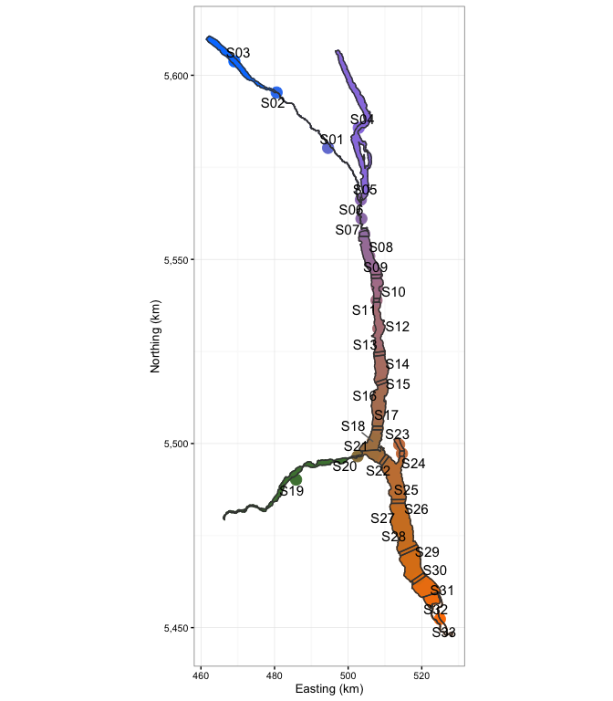

<!-- README.md is generated from README.Rmd. Please edit that file -->
**Note: Development has now moved to [lexr2](https://github.com/poissonconsulting/lexr2)**

Lake Exploitation Study Data Plotting and Analysis
==================================================

An R package to plot and analyse lake exploitation data.

``` r
# ensure required packages are loaded
library(dplyr)
library(ggplot2)
library(klexdatr)
library(lexr)

# set theme and font size
theme_set(theme_bw(base_size = 10))

# input hourly data
klex <- input_lex_data("klexdatr")

# select only those capture with a fork length greater than or equal to 500 mm
capture <- filter(klex$capture, Length >= 500, Reward1 == 100)

# combine hourly data into 24 hour intervals
kdetect <- make_detect_data(klex, capture = capture, start_date = as.Date("2008-04-01"),
                           end_date = as.Date("2013-12-31"))

# plot Kootenay Lake by color-coded section
plot_detect_section(kdetect)
```



``` r

# plot percent receiver coverage by color-coded section
plot_detect_coverage(kdetect)
```


``` r

# plot detections by fish, species, date and color-coded section.
plot_detect_overview(kdetect)
```


Installation
------------

To install and load the klexdatr package, execute the following code at the R terminal:

``` r
# install.packages("devtools")
devtools::install_github("poissonconsulting/lexr")
library(lexr)
```

Information
-----------

For more information, install and load the package and then type `?lexr` at the R terminal.

Acknowledgements
----------------


The project was primarily funded by the Habitat Conservation Trust Foundation.

The Habitat Conservation Trust Foundation was created by an act of the legislature to preserve, restore and enhance key areas of habitat for fish and wildlife throughout British Columbia. Anglers, hunters, trappers and guides contribute to the projects of the Foundation through licence surcharges. Tax deductible donations to assist in the work of the Foundation are also welcomed.
