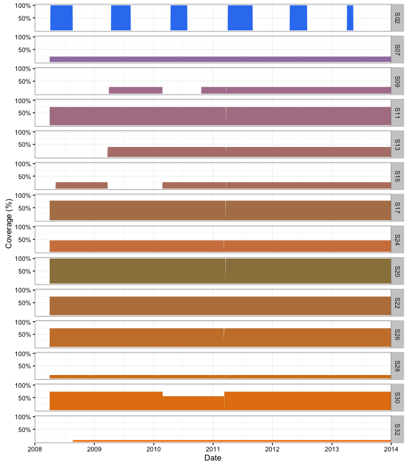

<!-- README.md is generated from README.Rmd. Please edit that file -->
``` r
library(dplyr)
#> 
#> Attaching package: 'dplyr'
#> 
#> The following objects are masked from 'package:stats':
#> 
#>     filter, lag
#> 
#> The following objects are masked from 'package:base':
#> 
#>     intersect, setdiff, setequal, union
library(magrittr)
library(qlexdatr)
library(lexr)

lex_data <- input_lex_data("qlexdatr")
lex_data %<>% check_lex_data()
#> Loading required package: sp

print(lex_data)
#> $section
#> Source: local data frame [25 x 3]
#> 
#>    Section SectionX SectionY
#>      (int)    (dbl)    (dbl)
#> 1        1  1300511 853963.2
#> 2        2  1301137 851791.7
#> 3        3  1301451 849862.5
#> 4        4  1302051 848480.9
#> 5        5  1302477 847060.1
#> 6        6  1303116 845317.4
#> 7        7  1305063 842552.3
#> 8        8  1309357 841285.2
#> 9        9  1312795 838945.4
#> 10      10  1313683 841534.7
#> ..     ...      ...      ...
#> 
#> $station
#> Source: local data frame [41 x 4]
#> 
#>    Station Section StationX StationY
#>      (int)   (int)    (dbl)    (dbl)
#> 1        1       1  1300593 853969.0
#> 2        2       3  1301568 849910.6
#> 3        3       5  1302482 847094.9
#> 4        4       7  1303467 843339.1
#> 5        5       7  1304628 843825.2
#> 6        6       7  1305481 842644.5
#> 7        7       7  1305749 840969.4
#> 8        8      10  1313248 842218.0
#> 9        9      10  1313357 839963.1
#> 10      10      10  1313464 841227.9
#> ..     ...     ...      ...      ...
#> 
#> $receiver
#> Source: local data frame [26 x 1]
#> 
#>    Receiver
#>       (int)
#> 1         1
#> 2         2
#> 3         3
#> 4         4
#> 5         5
#> 6         6
#> 7         7
#> 8         8
#> 9         9
#> 10       10
#> ..      ...
#> 
#> $deployment
#> Source: local data frame [43 x 4]
#> 
#>    Station Receiver  ReceiverDateTimeIn ReceiverDateTimeOut
#>      (int)    (int)              (time)              (time)
#> 1        3        1 2013-05-03 09:00:00 2014-04-25 16:00:00
#> 2       11        2 2013-05-03 09:00:00 2013-08-30 20:00:00
#> 3       14        3 2013-05-06 12:06:16 2013-10-25 11:23:49
#> 4       25        4 2013-05-14 09:00:00 2013-10-24 11:17:26
#> 5       26        5 2013-05-14 09:30:00 2013-10-24 10:53:25
#> 6       19        6 2013-05-14 09:33:00 2013-10-24 11:49:15
#> 7       33        7 2013-05-14 11:00:00 2014-04-29 12:00:00
#> 8       36        8 2013-05-14 11:45:00 2014-04-30 10:00:00
#> 9       39        9 2013-05-14 12:45:00 2014-04-25 12:15:00
#> 10      21       10 2013-05-14 17:39:45 2014-04-29 15:30:00
#> ..     ...      ...                 ...                 ...
#> 
#> $capture
#> Source: local data frame [225 x 10]
#> 
#>    Capture     CaptureDateTime Section    Species Length Weight Reward1
#>      (int)              (time)   (int)     (fctr)  (int)  (dbl)   (int)
#> 1        1 2013-04-17 10:15:00       9 Bull Trout    575     NA     100
#> 2        2 2014-06-18 15:00:00      13 Bull Trout    550     NA     100
#> 3        3 2014-09-25 13:00:00       1 Bull Trout    460     NA     100
#> 4        4 2015-09-13 07:00:00      25 Bull Trout    620     NA     100
#> 5        5 2015-09-24 11:11:00      25 Bull Trout    605    2.2     100
#> 6        6 2015-09-24 11:50:00      25 Bull Trout    549     NA     100
#> 7        7 2015-10-31 10:00:00       2 Bull Trout    497     NA     100
#> 8        8 2015-11-14 14:15:00       2 Bull Trout    570     NA     100
#> 9        9 2013-05-06 13:05:00       8 Lake Trout    612    2.4     100
#> 10      10 2013-05-06 13:53:00       8 Lake Trout    565    2.0     100
#> ..     ...                 ...     ...        ...    ...    ...     ...
#> Variables not shown: Reward2 (int), TagExpireDateTime (time),
#>   TagDepthRange (dbl)
#> 
#> $recapture
#> Source: local data frame [19 x 7]
#> 
#>      RecaptureDateTime Capture Section TBarTag1 TBarTag2 TagsRemoved
#>                 (time)   (int)   (int)    (lgl)    (lgl)       (lgl)
#> 1  2013-07-02 12:00:00     104      13     TRUE     TRUE       FALSE
#> 2  2014-05-08 12:00:00     105      13     TRUE     TRUE       FALSE
#> 3  2014-06-08 12:00:00      28      13     TRUE     TRUE       FALSE
#> 4  2014-06-17 12:00:00     142      14     TRUE     TRUE        TRUE
#> 5  2014-06-20 12:00:00     103      13     TRUE     TRUE       FALSE
#> 6  2014-06-22 12:00:00     107      15     TRUE     TRUE       FALSE
#> 7  2014-07-19 12:00:00     148      11     TRUE     TRUE       FALSE
#> 8  2014-07-22 12:00:00     144      13     TRUE     TRUE        TRUE
#> 9  2014-07-26 12:00:00     163      13     TRUE     TRUE       FALSE
#> 10 2014-08-02 12:00:00     139      13     TRUE     TRUE       FALSE
#> 11 2014-08-14 12:00:00     135      23     TRUE     TRUE       FALSE
#> 12 2014-10-15 12:00:00      23      13     TRUE     TRUE        TRUE
#> 13 2015-05-30 12:00:00     143      13     TRUE     TRUE        TRUE
#> 14 2015-05-30 12:00:00     136      24     TRUE     TRUE        TRUE
#> 15 2015-06-07 12:00:00     166      13     TRUE     TRUE       FALSE
#> 16 2015-06-07 12:00:00     111      13     TRUE     TRUE        TRUE
#> 17 2015-07-18 12:00:00     175      11     TRUE     TRUE       FALSE
#> 18 2015-08-02 12:00:00     180      11     TRUE     TRUE        TRUE
#> 19 2015-11-02 12:00:00       6      13    FALSE     TRUE        TRUE
#> Variables not shown: Released (lgl)
#> 
#> $detection
#> Source: local data frame [387,284 x 4]
#> 
#>      DetectionDateTime Capture Receiver Detections
#>                 (time)   (int)    (int)      (int)
#> 1  2013-06-27 00:00:00       1        5          4
#> 2  2013-06-27 17:00:00       1        1         10
#> 3  2013-06-28 00:00:00       1        2          3
#> 4  2013-06-28 02:00:00       1        2          4
#> 5  2013-06-28 11:00:00       1        2          3
#> 6  2013-06-28 21:00:00       1       12          3
#> 7  2013-06-30 10:00:00       1        4          7
#> 8  2013-06-30 12:00:00       1        4          3
#> 9  2013-07-01 21:00:00       1        2          9
#> 10 2013-07-01 23:00:00       1        2          3
#> ..                 ...     ...      ...        ...
#> 
#> $depth
#> Source: local data frame [29,301 x 4]
#> 
#>          DepthDateTime Capture Receiver Depth
#>                 (time)   (int)    (int) (dbl)
#> 1  2015-05-28 03:26:24     179        9     6
#> 2  2015-05-28 03:38:04     179        9     8
#> 3  2015-05-28 03:42:56     179        9     8
#> 4  2015-05-28 03:45:38     179        9     7
#> 5  2015-05-28 03:47:55     179        9     8
#> 6  2015-05-28 03:51:18     179        9     9
#> 7  2015-05-28 03:56:20     179        9     8
#> 8  2015-05-28 05:32:40     179        9     6
#> 9  2015-05-28 05:35:31     179        9     6
#> 10 2015-05-28 05:37:29     179        9     8
#> ..                 ...     ...      ...   ...
#> 
#> attr(,"class")
#> [1] "lex_data"

plot(lex_data)
#> Regions defined for each Polygons
```

      

Installation
------------

Then execute the following code at the R terminal:

``` r
# install.packages("devtools")
devtools::install_github("poissonconsulting/qlexdatr")
devtools::install_github("poissonconsulting/lexr")
```
